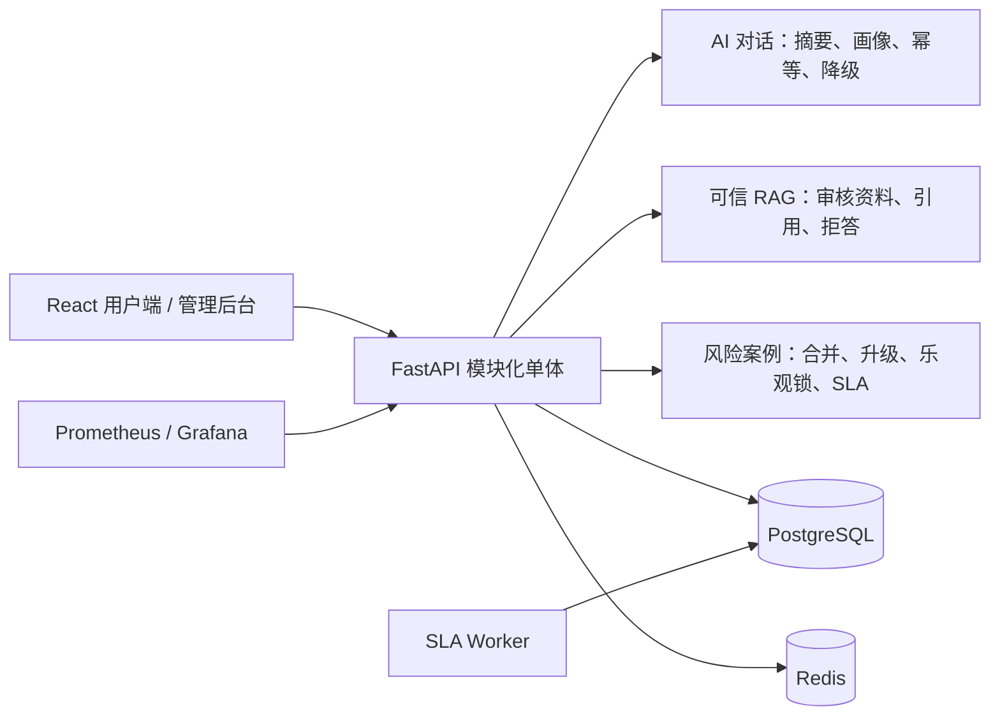

# 心晴 Campus

面向高校学生的 AI 心理支持与风险干预平台。项目重点不是堆叠页面，而是解决三类工程问题：**长对话与可信知识问答、高风险事件闭环、外部依赖故障下的系统可靠性**。

> 本项目提供心理支持和资源导航，不进行医疗诊断。高风险场景优先引导用户联系现实支持者、学校心理中心或紧急服务。

## 项目结果

| 问题 | 方案 | 可验证结果 |
| --- | --- | --- |
| AI 长对话容易丢失早期信息、重复请求可能重复写入 | 最近消息 + 长期摘要 + 用户画像；数据库幂等键和结果持久化 | 历史压缩、重复请求不重复写消息均有自动化测试 |
| RAG 可能引用未审核资料或在无证据时编造 | 只允许审核资料进入引用；私人/匿名会话仅作上下文；证据不足明确拒答 | 离线评测 11/11 通过，覆盖召回、拒答、风险和隐私边界 |
| 多名管理员可能重复领取或覆盖风险案例 | 30 分钟跨会话合并、严格状态机、条件 UPDATE 乐观锁、SLA Worker、只追加时间线 | 20 个并发领取请求仅 1 个成功；冲突返回 HTTP 409 |
| Redis/AI 故障会拖慢所有请求 | Cache Aside、空值缓存、随机 TTL、单飞回源、5 秒熔断、内存/安全回复降级 | 当前 Docker 故障实验 501/501 请求成功；首次失败 4044ms，熔断窗口 P50 334ms（下降 91.7%） |

上述数字的来源、限制和复现方式见 [性能报告](docs/PERFORMANCE.md)、[Docker Redis 故障原始报告](benchmarks/results/docker-cache-current/00-run-metadata.json) 与 [本地基线](benchmarks/results/local-sqlite-current.json)。开发机数据不代表生产容量。

## 核心链路



完整架构取舍见 [ARCHITECTURE.md](docs/ARCHITECTURE.md)，风险链路和 AI 时序图见 [SYSTEM_DESIGN.md](docs/SYSTEM_DESIGN.md)。

## 三个重点设计

### 1. AI 对话可靠性

- 共享 `httpx.AsyncClient`、连接池、并发信号量和分级超时。
- 仅对连接失败、读取超时、429、408、425、5xx 进行最多 2 次指数退避重试。
- 供应商不可用时返回本地安全回复；高风险规则不依赖模型。
- 对话达到阈值后把早期消息压缩进 `memory_summary`，同时保留最近消息和用户画像。
- `request_key` 通过数据库唯一约束和结果持久化保证重试不重复调用、不重复写消息。
- RAG 只引用审核知识资料；证据不足拒答；公开/私人会话不直接作为引用来源。

离线评测：

```powershell
$env:PYTHONPATH='.'
python evals/run_evals.py
```

评测数据、质量门槛和最新结果分别位于 [cases.json](evals/cases.json)、[评测说明](evals/README.md) 和 [latest.json](evals/results/latest.json)。

### 2. 风险事件工作流

- 规则识别是安全底线；模型仅能升级中风险结果，不能降低规则结果。
- 30 分钟内同一用户的重复风险信号合并到开放案例，并按新信号升级等级和 SLA。
- 管理员领取和状态流转使用 `WHERE id=? AND version=?` 条件更新。
- 严格状态机阻止非法跳转；每次操作写入只追加时间线、审计日志和站内通知。
- 独立 Worker 扫描 SLA，避免把定时任务绑定到某个 Web Worker。

### 3. 系统工程能力

- Redis：Cache Aside、负缓存、随机 TTL、本地单飞 + Redis 短锁、故障熔断。
- 数据：SQLAlchemy、Alembic、PostgreSQL/SQLite 双环境，关键热路径索引。
- 可观测性：HTTP、AI、缓存、风险案例指标，Prometheus、Grafana 和 5 条告警规则。
- 安全：短期 Access Token 仅存内存；Refresh Token 使用 HttpOnly Cookie 轮换；RBAC、上传文件头/归属校验、WebSocket 短期票据和连接限制。
- 前端：页面级代码分割、TanStack Query、管理后台标签页懒加载、统一超时和错误处理。

## 技术栈

- 前端：React 18、TypeScript、Vite、TanStack Query、Zustand、ECharts。
- 后端：FastAPI、SQLAlchemy 2、Pydantic 2、Alembic、JWT/RBAC。
- 数据与运维：PostgreSQL、Redis、Docker Compose、Nginx、Prometheus、Grafana。
- 质量：pytest、Vitest、Playwright、离线 AI/RAG Eval、可复现 HTTP Benchmark。

## 快速启动

复制配置并为公开部署生成独立密钥：

```powershell
Copy-Item .env.example .env
# 修改 SECRET_KEY、数据库密码、Grafana 密码；需要外部访问指标时设置 METRICS_TOKEN
docker compose up --build
```

- Web：`http://127.0.0.1:8088`
- OpenAPI：`http://127.0.0.1:8000/docs`
- 健康检查：`http://127.0.0.1:8000/api/health`
- Prometheus：`http://127.0.0.1:9091`
- Grafana：`http://127.0.0.1:3001`

生产环境检测到默认 `SECRET_KEY` 会拒绝启动。Compose 中 API 端口只绑定本机，公网入口由 Nginx 提供。

## 验证与复现

```powershell
$env:PYTHONPATH='.'
pytest -q
python evals/run_evals.py
```

```powershell
Set-Location frontend
npm ci
npm test
npm run build
```

浏览器 E2E：

```powershell
python -m playwright install chromium
# 分别启动 API 和 Vite 后
pytest tests/e2e -m e2e -q
```

压测：

```powershell
python tests/load/run_suite.py --base-url http://127.0.0.1:8000
./scripts/benchmark-cache-failure.ps1
```

压测报告包含 Git revision、操作系统、Python 版本、预热参数、状态码和每次请求的延迟样本。

## 测试边界

- 离线 Eval 验证本地安全底线，不等同于医疗有效性或真实模型共情质量评估。
- 当前 RAG 是中文词项/二元词检索基线，不宣称向量语义检索能力。
- Windows/SQLite 与 Docker Desktop 基准只用于回归，不代表生产容量。
- 真实 AI Key、短信和邮件服务只应在受控环境验证。

## 面试与简历材料

- [可直接改写的简历项目描述](docs/RESUME.md)
- [项目完整导读与面试问答](docs/PROJECT_GUIDE.md)
- [部署、安全和已知边界](docs/DEPLOYMENT.md)
- [API 清单](docs/API.md)
