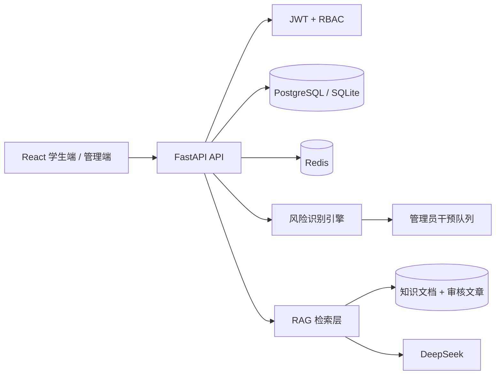

# 系统架构与版本能力

## 请求链路

## 四个版本

| 版本 | 能力 | 可验证入口 |
| --- | --- | --- |
| V1 | JWT 登录、DeepSeek 对话、情绪记录、文章社区、Docker Compose | `/docs`、学生端六个页面 |
| V2 | 风险评分、干预队列、内容审核、运营分析、结构化摘要与标签 | `/api/admin/*`、运营工作台 |
| V3 | Redis 缓存与限流、RBAC、请求日志、统一错误、CI、压测 | `cache.py`、GitHub Actions、`tests/load` |
| V4 | RAG、历史压缩、趋势预测、可解释推荐、内容安全 | `/api/knowledge/*`、`/api/analytics/mood-forecast` |

## 安全边界

- 平台提供心理支持和资源导航，不提供诊断或治疗结论。
- 高风险信息会创建风险事件，只有管理员可查看和处置。
- AI 会话默认私人；公开内容仍需经过社区安全规则。
- 管理端手机号脱敏展示，写接口由 JWT 和 RBAC 控制。
- RAG 回答携带检索来源；资料不足时明确拒答。

## 算法说明

- 风险识别：可解释规则评分，结合文本信号与近期情绪下降趋势；不是医学诊断模型。
- 历史压缩：保留用户主题与主要情绪，不存储模型思维过程；旧轮次摘要与最近 10 轮共同进入上下文。
- 情绪预测：线性回归基线，输出样本量、置信度和免责声明，预测值限制在 1-10。
- 推荐：近期情绪标签映射内容类别，再以热度排序，并向前端返回推荐原因。
- RAG：中文字符与二元词项检索，通过相关度排序后将前 4 条资料交给 DeepSeek 生成有依据的回答。
