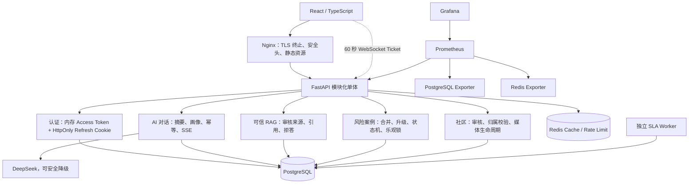

# 系统架构

## 架构定位

系统是一个模块化单体应用，配套独立 SLA Worker、PostgreSQL、Redis 和监控组件。它没有服务发现、分布式事务或跨服务调用链治理，因此不包装成微服务。

## 关键边界

- 浏览器永远无法读取 Refresh Token；Access Token 只存在于 JS 内存。
- RAG 引用仅来自已审核知识文档和已发布文章。用户历史和匿名公开经历只能帮助归纳上下文，不能作为可引用事实。
- 高风险判断的确定性规则不依赖模型；模型只允许升级风险等级。
- Redis 保存可丢失的短期状态。AI 幂等结果、风险案例和审计记录保存于数据库。
- 多实例生产环境必须使用共享 Redis；内存缓存只用于本地故障降级。

## 可靠性策略

| 故障 | 处理 |
| --- | --- |
| AI 连接失败、超时、429、5xx | 有界重试、指数退避；耗尽后安全回复 |
| Redis socket 故障 | 5 秒熔断，直接走内存/数据库，避免每次请求等待超时 |
| 浏览器重复提交 AI 请求 | 数据库幂等键占位并复用已完成结果 |
| 两名管理员同时领取案例 | `id + version` 条件 UPDATE，仅一个请求成功 |
| API Worker 重启 | 会话、案例、幂等和通知均在数据库恢复 |
| SLA Worker 重复扫描 | 每个超时案例只追加一次对应升级记录和通知 |

## 验证入口

- 业务、安全和并发：`pytest -q`
- AI/RAG 安全底线：`python evals/run_evals.py`
- 浏览器核心链路：`pytest tests/e2e -m e2e -q`
- 性能原始样本：`python tests/load/run_suite.py`
- Redis 故障实验：`scripts/benchmark-cache-failure.ps1`
