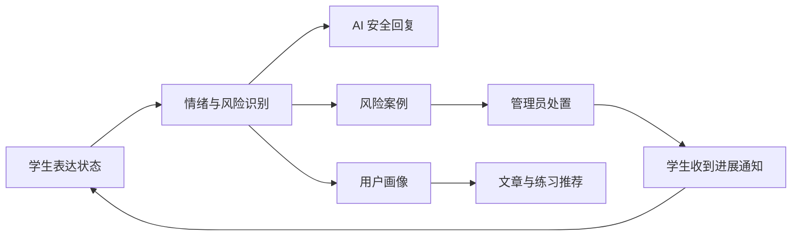
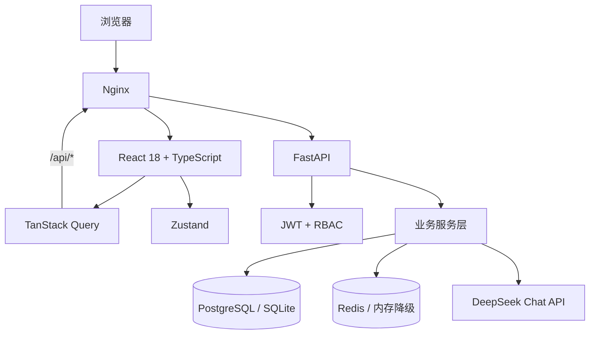
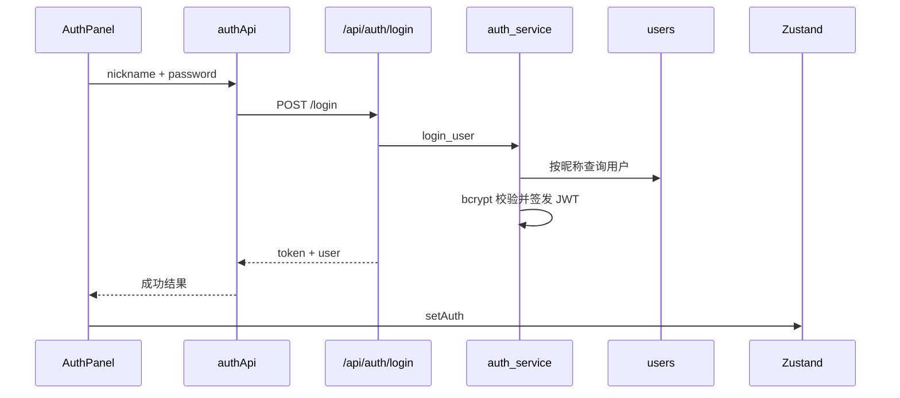
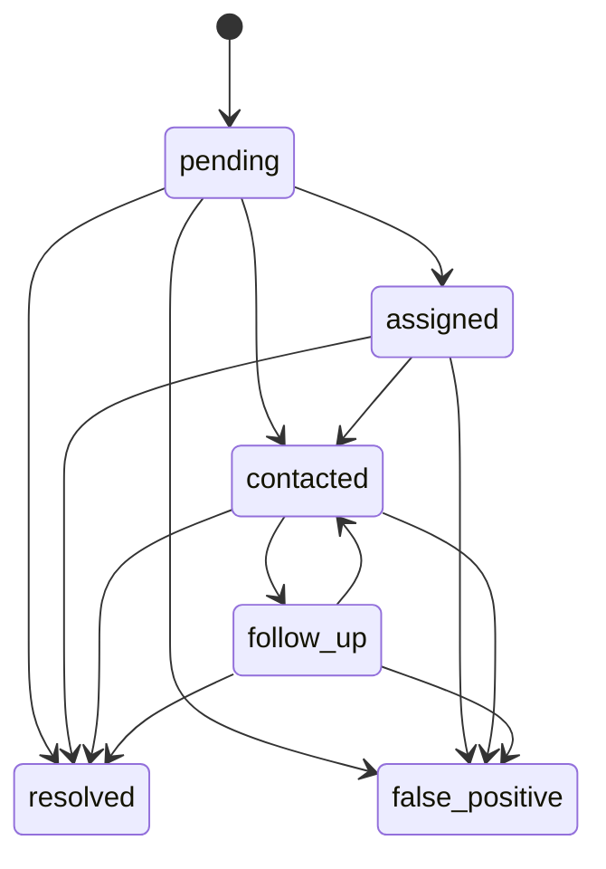

# 心晴 Campus 项目全景学习手册

这份文档的目标不是简单列出目录，而是帮助你做到三件事：

1. 能从用户操作出发，讲清楚一次请求怎样经过前端、接口、业务服务和数据库。
2. 能解释项目里的关键设计为什么存在，而不只是说“我用了某某技术”。
3. 面试时能诚实地区分已经实现的能力、当前实现的取舍和下一步演进方向。

建议先读“项目全景”和“功能到代码映射”，再按最后的学习路线逐个断点调试。

## 1. 一句话定义项目

心晴 Campus 是一个面向高校学生的心理健康支持平台。学生可以记录情绪、与 AI 多轮对话、查看可信心理内容并参与同伴社区；系统会识别高风险信号，形成管理员可领取、跟进、结案和审计的安全处置闭环。

它的核心价值不是“接入了 DeepSeek”，而是把以下业务链路连接起来：



平台只提供心理支持和资源导航，不提供医疗诊断。风险规则也是工程演示规则，不是经过临床验证的诊断模型。

## 2. 系统全景



本地开发时，Vite 在 `5173` 端口运行并把 `/api` 代理到 `8000`；Docker 环境中由 Nginx 在 `8080` 提供前端并反向代理 API。

## 3. 技术栈以及各自负责什么

| 层级 | 技术 | 在项目中的具体责任 |
| --- | --- | --- |
| UI | React 18、TypeScript | 页面组件、交互、类型约束 |
| 路由 | React Router 6 | 学生页面和管理员页面切换、未授权后台重定向 |
| 服务端状态 | TanStack Query | 请求、缓存、加载状态、写操作后刷新关联数据 |
| 客户端状态 | Zustand | 持久化登录令牌、当前用户和当前会话 ID |
| 表单 | React Hook Form、Zod | 登录注册和业务表单状态、前端输入校验 |
| 图表 | ECharts | 情绪趋势、平台活动和后台运营趋势 |
| 构建 | Vite、TypeScript | 开发服务器、代理、类型检查和生产打包 |
| API | FastAPI | 路由、依赖注入、参数校验、OpenAPI 文档、异常响应 |
| ORM | SQLAlchemy 2 | 数据模型、查询、事务和数据库会话 |
| Schema | Pydantic 2 | 请求参数约束和响应序列化 |
| 认证 | JWT、Passlib/Bcrypt | 密码哈希、令牌签发、当前用户解析和 RBAC |
| 数据库 | PostgreSQL | Docker/生产主数据库 |
| 本地数据库 | SQLite | 不安装 PostgreSQL 时的开发降级方案 |
| 缓存 | Redis | 验证码、限流、统计结果和文章数据缓存 |
| AI | DeepSeek Chat API | 安全范围内的自然语言回复和中风险辅助复核 |
| 迁移 | Alembic | 从空库按版本创建和升级数据库结构 |
| 部署 | Docker Compose、Nginx | PostgreSQL、Redis、API、前端四服务编排 |
| 测试与 CI | pytest、Vitest、GitHub Actions | 后端接口测试、前端状态测试、自动构建检查 |

一个重要事实：后端目前是同步 FastAPI + 同步 SQLAlchemy，会直接同步调用 DeepSeek。代码简单、适合演示，但高并发时 AI 请求会占用工作线程，后续可演进为异步 HTTP 客户端或任务队列。

## 4. 仓库目录怎么读

```text
mental_health_website/
├─ backend/
│  ├─ main.py                 # FastAPI 应用入口、中间件、异常处理、路由注册
│  ├─ auth.py                 # JWT、密码、当前用户、管理员依赖
│  ├─ schemas.py              # 通用 Pydantic 请求/响应模型
│  ├─ core/config.py          # .env 与运行配置
│  ├─ routers/                # HTTP 接口层
│  ├─ services/               # AI、风险、缓存、画像、审核等业务规则
│  └─ repositories/           # 用户和文章的数据访问封装
├─ database/
│  ├─ database.py             # Engine、Session、Base、本地 SQLite 兼容升级
│  └─ models.py               # 20 张业务表的 ORM 模型
├─ frontend/
│  ├─ src/main.tsx            # React 启动和 QueryClient
│  ├─ src/App.tsx             # 总布局、导航和页面路由
│  ├─ src/api/                # 统一请求客户端和所有前端 API 方法
│  ├─ src/store/              # 登录和聊天 Zustand Store
│  ├─ src/components/         # 登录注册面板、登录保护组件
│  ├─ src/pages/              # 七个学生/管理页面
│  └─ src/styles.css          # 当前 React 应用的全局样式
├─ alembic/versions/          # 0001 到 0005 数据库迁移
├─ tests/test_api.py          # 后端业务、安全、并发与故障回归
├─ tests/test_ai_provider.py  # AI 上游超时、限流和异常响应故障注入
├─ tests/e2e/                 # Playwright 核心浏览器链路
├─ evals/                     # RAG、风险、隐私离线质量门槛
├─ tests/load/benchmark.py    # 简单 HTTP 压测脚本
├─ docs/                      # 架构、接口、验收、性能和本手册
├─ seed.py                    # 清库并插入演示数据
├─ run.py                     # 本地 API 启动入口
├─ docker-compose.yml         # 四服务编排
└─ .github/workflows/ci.yml   # GitHub Actions
```

`frontend/css/style.css` 和 `frontend/js/app.js` 是旧版静态前端遗留文件。当前 `frontend/index.html` 只加载 `/src/main.tsx`，所以学习当前系统时以 `frontend/src` 为准。

后端已经形成 router/service/repository 分层，但并非所有模块都完全仓储化：用户和文章使用 repository，部分路由仍直接写 SQLAlchemy 查询。这是当前实现事实，不要在面试中说成“严格领域分层”。

## 5. 功能对应哪些代码

下表是整个项目最重要的代码索引。顺着一行横向阅读，就能看到一个功能如何贯穿全栈。

| 功能 | 前端页面/组件 | 前端请求 | 后端接口 | 核心服务 | 主要数据表 |
| --- | --- | --- | --- | --- | --- |
| 登录注册 | `frontend/src/components/AuthPanel.tsx` | `authApi` | `routers/auth.py`、`routers/users.py` | `auth_service.py`、`cache.py`、`auth.py` | `users` |
| 总览首页 | `pages/DashboardPage.tsx` | `analyticsApi`、`moodApi`、`recommendationsApi` | `routers/analytics.py`、`routers/mood.py`、`routers/recommendations.py` | `cache.py`、`user_profile.py` | 多表聚合 |
| 情绪记录 | `pages/MoodPage.tsx` | `moodApi` | `routers/mood.py` | `risk_engine.py`、`risk_cases.py` | `mood_logs`、`bookmarks`、`risk_events` |
| AI 倾听 | `pages/ConsultPage.tsx` | `consultApi` | `routers/consult.py` | `ai_client.py`、`conversation_memory.py`、`idempotency.py` | `consultations`、`chat_messages` |
| 用户画像 | AI 页面和首页间接展示 | `authApi.profile` | `routers/users.py` | `user_profile.py` | `user_profiles` |
| 风险识别 | 首页提醒、AI 安全提示 | `moodApi.riskStatus` | `routers/consult.py`、`routers/mood.py` | `risk_engine.py`、`risk_cases.py` | `risk_events`、`risk_actions` |
| 心理内容检索 | `pages/ArticlesPage.tsx` | `contentApi`、`articlesApi` | `routers/content.py`、`routers/articles.py` | `content_search.py`、`article_service.py`、`article_crawler.py` | `consultations`、`articles`、`comments` |
| RAG 问答 | `pages/ArticlesPage.tsx` | `knowledgeApi` | `routers/knowledge.py` | `rag.py`、`ai_client.py` | `knowledge_documents`、`articles` |
| 个性化推荐 | 首页、文章页、AI 回复 | `recommendationsApi` | `routers/recommendations.py` | `user_profile.py` | `user_profiles`、`exercises`、`articles` |
| 同伴社区 | `pages/CommunityPage.tsx`、`pages/ShareEditorPage.tsx`、`components/CommunityMediaComposer.tsx` | `discussionsApi` | `routers/community.py` | `content_moderation.py`、WebSocket 广播 | `discussions`、`plaza_messages`、`replies`、`discussion_likes`、`reports` |
| 个人中心 | `pages/ProfilePage.tsx`、`components/AuthPanel.tsx` | `authApi`、`discussionsApi.mine` | `routers/users.py` | 密码校验、短信/邮件验证码、受控图片上传 | `users`、`discussions` |
| 运营后台 | `pages/AdminPage.tsx` | `adminApi` | `routers/admin.py` | `risk_cases.py`、`audit.py`、`article_service.py` | 风险、内容、用户、审计相关表 |
| 站内通知 | `pages/DashboardPage.tsx` | `authApi.notifications` | `routers/users.py` | `risk_cases.py` 生成通知 | `user_notifications` |
| 请求追踪 | 全站 | `api/client.ts` 接收错误 | `backend/main.py` | 日志中间件 | 无 |

前端所有 API 方法集中在 `frontend/src/api/queries.ts`，统一底层请求在 `frontend/src/api/client.ts`。遇到一个按钮不知道调了什么接口时，先找页面中的 mutation，再跳到这里。

## 6. 前端架构

### 6.1 启动与路由

`frontend/src/main.tsx` 做三件事：

1. 创建 TanStack Query 的 `QueryClient`。
2. 使用 `BrowserRouter` 管理页面路由。
3. 渲染 `App` 并加载 `styles.css`。

`frontend/src/App.tsx` 负责应用壳层：左侧导航、顶部标题、登录面板和页面路由。页面使用 `lazy` 和 `Suspense` 按需加载。管理员入口只在角色为 `admin` 时显示，直接访问 `/admin` 也会被前端重定向。`/community/new` 是独立的同伴分享编辑页，旧的 `/records` 会跳转到心理内容中的公开倾听检索。

注意：前端隐藏菜单只是体验控制，真正的安全边界仍然是后端的 `require_admin`。

### 6.2 状态为什么分成两类

服务端数据交给 TanStack Query，例如文章列表、情绪记录和风险队列。它们来自 API，适合缓存、重取和失效刷新。

本地会话状态交给 Zustand：

- `store/auth.ts`：令牌和当前用户，持久化键为 `mh-auth`。
- `store/chat.ts`：当前 `conversationId`，持久化键为 `mh-chat`。

写操作成功后，页面通过 `queryClient.invalidateQueries` 刷新相关数据。例如新增情绪后会刷新情绪列表、预测、首页统计和风险状态。

### 6.3 统一请求客户端

`api/client.ts` 在请求前从 Zustand 读取 token，并自动加入：

```http
Authorization: Bearer <token>
Content-Type: application/json
```

非 2xx 响应会被转换为 `ApiError`。上传媒体时传入 `FormData`，浏览器会自动生成 multipart boundary，客户端不会强行覆盖 `Content-Type`。公开接口通过 `{ auth: false }` 明确表示不依赖登录。

### 6.4 各页面负责什么

| 页面 | 责任 |
| --- | --- |
| `DashboardPage.tsx` | 平台概览、个人情绪趋势、预测、风险提醒、通知、推荐内容 |
| `MoodPage.tsx` | 新增情绪、公开/私人可见性、公共情绪流、收藏 |
| `ConsultPage.tsx` | 新建/切换会话、加载历史、发送消息、逐条设置公开/私人、展示风险和练习建议 |
| `ArticlesPage.tsx` | 公开倾听与心理文章双区检索、时间/标题筛选、外部文章来源、个性化推荐、RAG 问答、管理员内容发布 |
| `CommunityPage.tsx` | 浏览长分享、实时交流广场、回复、点赞、举报、查看自己的待审或私密内容 |
| `ShareEditorPage.tsx` | 独立编辑并发布文字、图片或语音同伴分享 |
| `ProfilePage.tsx` | 背景和头像、昵称签名、社区发布历史、手机号/邮箱绑定、密码修改和退出登录 |
| `AdminPage.tsx` | 风险处置、举报、审核、用户角色、文章状态、敏感词、审计日志 |

## 7. 后端请求生命周期

所有请求先进入 `backend/main.py`：

1. CORS 中间件检查前端来源。
2. `request_context` 读取或生成 `X-Request-ID`。
3. FastAPI 根据路径进入对应 router。
4. `Depends(get_sync_db)` 创建 SQLAlchemy Session。
5. 需要身份的接口通过 `get_current_user` 解 JWT。
6. 业务成功后提交事务，Session 在请求结束时关闭。
7. 响应带回 `X-Request-ID`，访问日志记录耗时和状态码。
8. HTTP、参数校验和未知异常被转换为统一 JSON 错误结构。

统一错误大致长这样：

```json
{
  "code": "HTTP_403",
  "detail": "需要管理员权限",
  "request_id": "..."
}
```

开发环境启动时会执行 `init_db()`，自动建表，并为旧 SQLite 数据库补充缺失字段。正式数据库结构应以 Alembic 迁移为准。

## 8. 三条最重要的完整调用链

### 8.1 登录链路



注册多出一条短信验证码链路：`/send-code` 把验证码存入 Redis，未配置 Redis 时存入进程内存；本地开发会把 `dev_code` 返回给前端，生产环境必须配置短信网关。

后续受保护请求由 `api/client.ts` 自动带 JWT。`backend/auth.py` 解析 token 中的 `sub`，再从 `users` 表查当前用户。任何客户端传来的 `user_id` 都不能替代服务端身份。

### 8.2 AI 对话链路

入口是 `POST /api/consult/chat`，核心实现位于 `backend/routers/consult.py`。

1. 前端用当前 `conversationId` 和 `crypto.randomUUID()` 生成的 `request_key` 发起请求。
2. `idempotency.begin_operation` 尝试占用 `(user_id, operation, request_key)`。
3. Redis/内存计数器限制每个用户每分钟最多 20 次咨询请求。
4. 服务端校验已有会话是否属于当前用户，防止越权读取或续写。
5. 查询该会话全部消息和用户最近 5 条情绪评分。
6. `risk_engine.assess_risk` 先执行确定性规则评分。
7. 规则为 `medium` 时，DeepSeek 可以做二次复核，但只能升级风险，不能推翻规则降级。
8. 组装用户画像、长期摘要和最近消息，调用 `ai_client.chat`。
9. `high/critical` 不调用普通聊天，而是直接返回本地危机安全回复。
10. 写入用户消息、AI 回复、会话摘要、情绪标签和用户画像。
11. 高风险时调用 `create_or_escalate_case` 创建或升级风险案例。
12. 对话达到 12 条消息后，把较旧部分压缩到 `memory_summary`，保留最近消息。
13. 根据情绪匹配最多 3 个练习，一起返回前端。
14. 将完整响应存进 `idempotency_records`；同一个 key 重试时直接返回原响应，不重复写消息。

AI 上下文可以概括为：

```text
系统安全 Prompt
+ 用户支持画像
+ 更早对话的 memory_summary
+ 最近最多 12 条消息
+ 当前用户消息
```

这里的“记忆压缩”是规则摘要，不是调用模型总结，也不保存模型思维过程。

### 8.3 风险处置闭环

风险有两个入口：AI 文本和连续下降的情绪评分。



`risk_events` 保存案例当前快照，`risk_actions` 保存不可覆盖的处置时间线。一个会话已有开放案例时，新风险信号会升级原案例，不重复创建待办。

SLA 由风险等级决定：

| 等级 | 默认截止时间 |
| --- | --- |
| `critical` | 15 分钟 |
| `high` | 2 小时 |
| 其他需关注事件 | 24 小时 |

管理员更新案例时必须提交 `expected_version`。`transition_case` 使用 `WHERE id = ? AND version = ?` 原子更新；若另一名管理员先修改了案例，当前请求返回 409，前端应刷新后重试。这就是乐观锁。

处置同时发生四件事：

1. 更新 `risk_events` 当前状态。
2. 新增 `risk_actions` 时间线。
3. 新增 `admin_audit_logs` 管理审计记录。
4. 在联系、随访或结案时新增 `user_notifications`，让学生看到处理进展。

这四步让项目从“风险打标签”变成了可追踪的真实业务闭环。

## 9. 其他核心业务怎么走

### 9.1 情绪记录与趋势预测

`MoodPage` 提交分数、触发因素、备注和可见范围。后端强制用 JWT 当前用户 ID 覆盖身份，先保存 `mood_logs`，再把最近分数组合后交给风险引擎。

预测接口 `/api/analytics/mood-forecast` 对个人最近数据做一元线性回归：

- 斜率大于 `0.08`：改善。
- 斜率小于 `-0.08`：下降。
- 其余：稳定。
- 预测值限制在 1 到 10。
- 置信度由样本数量和残差共同估算，结果缓存 5 分钟。

这是可解释的基线模型，不应包装成专业心理预测模型。

### 9.2 用户画像与推荐

`user_profile.py` 从最近 20 条用户消息中提取：

- 主要情绪：复用 `infer_emotion` 关键词规则。
- 压力来源：学习、睡眠、人际、家庭、就业。
- 应对偏好：运动、倾诉、放松、任务拆分。

文章推荐使用近期咨询情绪、最近情绪分数和画像作为特征。先把情绪映射到内容类别，再以类别匹配优先、阅读量次优进行排序，并返回“根据近期焦虑状态推荐”等解释。

练习推荐同样是情绪到练习类别的规则排序。当前是推荐系统雏形，不是协同过滤或深度学习模型。

### 9.3 RAG 心理知识库

`rag.py` 的流程是：

1. 从已发布 `knowledge_documents` 和已发布 `articles` 取候选资料。
2. 把中文拆为单字和二元词组，把英文/数字拆为普通 token。
3. 计算查询 token 在文档中的词频分数，并做长度归一化。
4. 保留相关度达到动态阈值的前 4 条资料。
5. 登录用户额外检索本人相关历史会话，包括本人的私人记录；再检索其他用户主动设为公开的相关会话。
6. 同时取出匹配会话中的学生消息和 AI 回复，进入模型前隐藏手机号、邮箱和常见社交账号。
7. 有 DeepSeek 时，把审核资料和倾听上下文分区拼入 Prompt。审核资料可以引用，倾听上下文只允许归纳，不允许逐字复述或暴露身份。
8. 接口只向前端返回引用资料和使用了几段历史的统计，不返回其他用户的原始对话。
9. 无密钥时优先返回最相关审核资料的摘要；只有倾听上下文时不直接回显聊天内容。
10. 没有相关资料或记录时明确说明信息不足，不让模型自由发挥。

当前实现没有向量数据库、Embedding、文档切块和重排模型，因此准确说法是“轻量检索增强问答基线”。

### 9.4 社区内容安全

用户发帖或回复时，`content_moderation.py` 合并默认敏感词和后台配置的启用词。命中后内容状态变为 `pending_review`，不会出现在公共列表；未命中则为 `published`。

同伴分享和实时广场都支持文字、图片、语音。媒体先经过 `/api/discussions/media` 上传，后端限制 MIME 类型和大小，并只接受平台生成的 `/uploads/community/` 地址。广场消息写入 `plaza_messages` 后再通过 `/api/discussions/plaza/ws` 广播刷新事件；前端同时每 5 秒轮询一次，断线时仍能补齐消息。

私密内容只有作者和管理员可查看。点赞表通过 `(discussion_id, user_id)` 唯一约束防止重复点赞。举报进入 `reports`，管理员可处置举报并审核内容，关键动作写入审计日志。

这里同时实现了四种安全边界：内容状态、公开/私人可见性、对象所有权、管理员角色。

## 10. 数据表的职责

### 用户与状态

| 表 | 作用 |
| --- | --- |
| `users` | 账号、密码哈希、手机号、邮箱、头像、背景、签名和角色 |
| `user_profiles` | 长期支持画像、主要情绪、手动推荐状态、压力源、偏好 |
| `mood_logs` | 情绪分数、触发因素、备注、可见性 |
| `bookmarks` | 用户收藏公开情绪记录的关联 |

### AI 咨询与安全

| 表 | 作用 |
| --- | --- |
| `consultations` | 会话聚合根：标题、摘要、长期记忆、风险快照、干预状态 |
| `chat_messages` | 每一条 user/assistant 原始消息 |
| `risk_events` | 风险案例当前状态、等级、SLA、负责人和版本号 |
| `risk_actions` | 风险案例不可覆盖的状态变更时间线 |
| `idempotency_records` | AI 请求占位、处理状态和已完成响应 |
| `user_notifications` | 面向学生的支持进展通知 |

### 内容与社区

| 表 | 作用 |
| --- | --- |
| `articles` | 心理文章、来源链接、原始发布日期、发布状态和阅读量 |
| `comments` | 文章评论 |
| `discussions` | 社区帖子、审核状态、可见性和计数 |
| `plaza_messages` | 实时交流广场的文字、图片、语音、审核状态和发布时间 |
| `replies` | 社区回复及审核状态 |
| `discussion_likes` | 点赞关系和唯一约束 |
| `reports` | 用户举报及处理结果 |
| `sensitive_words` | 后台可配置的审核关键词 |
| `knowledge_documents` | RAG 的审核知识资料 |
| `exercises` | 可按情绪推荐的支持练习 |

### 运营治理

| 表 | 作用 |
| --- | --- |
| `admin_audit_logs` | 管理员、动作、对象、详情和 request_id |

当前模型主要通过 `user_id`、`consultation_id` 等整数建立逻辑关联，没有声明数据库 ForeignKey 和 SQLAlchemy relationship。优点是代码直观、迁移简单；缺点是数据库无法自动保证引用完整性，删除时也要手工清理。生产化演进应补外键、级联策略和必要的 ORM 关系。

## 11. 权限模型

系统只有两个角色：

- `student`：使用学生端能力，只能操作自己的私密数据。
- `admin`：拥有学生能力，并可访问 `/api/admin/*` 和知识文档写接口。

`backend/auth.py` 中三个依赖的区别：

| 依赖 | 用途 |
| --- | --- |
| `get_current_user` | 必须登录，否则 401 |
| `get_optional_user` | 可匿名，登录后可识别私密内容所有者 |
| `require_admin` | 必须登录且角色为 admin，否则 403 |

对象级权限仍需路由自己检查。例如会话历史必须同时满足“已登录”和“该 consultation.user_id 等于当前用户”。RBAC 解决角色权限，对象所有权检查解决同角色用户之间的数据隔离。

## 12. 缓存、幂等和一致性

### Redis 缓存

`services/cache.py` 封装了字符串、JSON、计数、验证码和前缀删除。启动时会尝试连接 Redis，失败则使用进程内字典。

主要缓存包括：

- 注册验证码。
- 短信和 AI 接口限流计数。
- 平台概览统计，TTL 30 秒。
- 个人情绪预测，TTL 5 分钟。
- 文章列表、详情和热门数据。

写操作后会主动删除相关 key。内存降级适合单进程本地开发，生产多实例必须使用 Redis，否则各实例的验证码、限流和缓存互不一致。

### 请求幂等

前端每次发送 AI 消息生成唯一 `request_key`。数据库唯一约束保证同一用户、同一操作、同一 key 只有一条记录：

- `processing` 且 5 分钟内：返回 409，避免并发重复执行。
- `completed`：反序列化原响应并直接返回。
- `processing` 超过 5 分钟：允许重新接管。

幂等结果保存在数据库而不是 Redis，因此进程重启后仍可复用。

### 乐观锁

风险案例是读多写少场景，不需要长事务悲观锁。管理员提交读到的 `version`，更新时比较版本；冲突就返回 409。这比“最后写入者覆盖前人结果”更适合运营协作。

## 13. 配置、启动与部署

配置入口是 `.env`，模板见 `.env.example`。重点变量：

| 变量 | 作用 |
| --- | --- |
| `APP_ENV` | `development` 时自动建表并允许本地验证码 |
| `SECRET_KEY` | JWT 签名密钥，生产必须更换 |
| `DATABASE_URL` | SQLite 或 PostgreSQL 连接 |
| `REDIS_URL` | Redis 地址，空值时使用内存降级 |
| `DEEPSEEK_API_KEY` | DeepSeek 密钥 |
| `DEEPSEEK_URL` | DeepSeek Chat Completions 地址 |
| `SMS_WEBHOOK_URL` | 真实短信网关 Webhook |
| `EMAIL_WEBHOOK_URL` | 邮箱验证码服务 Webhook；开发环境未配置时返回本地验证码 |
| `CORS_ORIGINS` | 允许调用 API 的前端来源 |

不要把真实 API key 提交到 Git。已经在聊天、日志或仓库中暴露过的 key 应立即去供应商控制台轮换。

### 本地 SQLite 开发

把 `.env` 中数据库改为：

```env
APP_ENV=development
DATABASE_URL=sqlite:///./mental_health_v2.db
REDIS_URL=
```

启动后端：

```powershell
environment\venv\Scripts\python.exe run.py
```

启动前端：

```powershell
Set-Location frontend
npm install
npm run dev
```

访问 `http://127.0.0.1:5173`，API 文档是 `http://127.0.0.1:8000/docs`。

### Docker Compose

```powershell
Copy-Item .env.example .env
docker compose up --build
```

启动顺序是 PostgreSQL/Redis 健康后启动 API，API 先执行 `alembic upgrade head`，健康后再启动 Nginx 前端。访问地址为：

- Web：`http://127.0.0.1:8080`
- OpenAPI：`http://127.0.0.1:8000/docs`
- 健康检查：`http://127.0.0.1:8000/api/health`

### 演示数据

```powershell
environment\venv\Scripts\python.exe seed.py
```

`seed.py` 会先清空业务数据再重建演示数据，不要在需要保留的数据环境执行。

演示账号：

| 角色 | 昵称 | 密码 |
| --- | --- | --- |
| 学生 | 测试用户1 | `123456` |
| 管理员 | 平台管理员 | `admin123` |

## 14. 数据库迁移如何演进

| 版本 | 主要内容 |
| --- | --- |
| `0001_initial_schema` | 用户、情绪、咨询、文章、社区等基础表 |
| `0002_safety_operations` | 风险、举报、敏感词和安全运营字段 |
| `0003_rag_memory` | 知识文档、对话记忆和 RAG 能力 |
| `0004_profiles_community` | 用户画像、练习、社区点赞和运营增强 |
| `0005_case_workflow` | 风险案例状态机、审计、幂等和站内通知 |
| `0006_article_sources` | 外部文章来源、原文链接和原始发布日期 |
| `0007_community_media_plaza` | 同伴分享媒体字段和实时广场消息表 |
| `0008_user_profile_center` | 邮箱、背景图、个性签名和资料更新时间 |

常用命令：

```powershell
environment\venv\Scripts\alembic.exe current
environment\venv\Scripts\alembic.exe upgrade head
environment\venv\Scripts\alembic.exe revision --autogenerate -m "change_name"
```

修改 ORM 模型后不要只依赖开发环境的 `create_all`，还要生成迁移并验证从空库升级到 head。

## 15. 测试覆盖了什么

后端测试集中在 `tests/test_api.py`，当前 17 项覆盖：

- 未登录写操作被拒绝。
- JWT 当前用户和伪造 `user_id` 防护。
- DeepSeek 缺失时安全降级。
- 高风险聊天创建案例。
- 管理员 RBAC。
- 社区敏感内容进入待审。
- RAG 无模型时仍返回引用。
- 情绪预测边界和解释。
- 对话历史压缩保留用户上下文。
- 私密帖子对象权限和可逆点赞。
- 连续低情绪创建趋势风险。
- 对话更新用户画像并推荐练习。
- 文章下架后缓存失效。
- 公开倾听检索隔离私人会话，并支持标题和时间筛选。
- 文章按原始发布日期筛选，采集器只保存来源页元数据。
- AI 请求幂等不重复写消息。
- 重复高风险信号只升级一个开放案例。
- 案例乐观锁、审计、时间线和通知。
- 非法风险状态跳转被拒绝。

运行质量检查：

```powershell
environment\venv\Scripts\pytest.exe -q
Set-Location frontend
npm test
npm run build
```

GitHub Actions 在 push 到 `main/master` 或提交 PR 时自动执行同类检查。前端目前主要测试 Zustand 登录状态，页面交互测试仍偏少，这是需要诚实说明的测试缺口。

## 16. 推荐的代码学习顺序

不要从 300 多行的后台页面开始硬读。按以下顺序，每一步都配合浏览器 Network 和后端断点：

1. `frontend/src/main.tsx`：理解 React 应用如何启动。
2. `frontend/src/App.tsx`：记住页面路由和整体布局。
3. `frontend/src/api/client.ts`：理解 JWT 怎样进入每个请求。
4. `frontend/src/api/queries.ts`：建立“前端动作到 API”的总索引。
5. `backend/main.py`：理解请求进入路由前后发生什么。
6. `database/database.py` 和 `database/models.py`：认识 Session 和 20 张表。
7. `backend/auth.py`、`routers/auth.py`：走通登录注册。
8. `pages/MoodPage.tsx`、`routers/mood.py`：走通一个简单写请求和缓存失效。
9. `pages/ConsultPage.tsx`、`routers/consult.py`：走通核心 AI 主链路。
10. `risk_engine.py`、`risk_cases.py`：理解规则、状态机、SLA 和乐观锁。
11. `AdminPage.tsx`、`routers/admin.py`：理解运营闭环和审计。
12. `rag.py`、`recommendations.py`：理解两个算法基线。
13. `tests/test_api.py`：用测试反向确认系统承诺的行为。
14. `docker-compose.yml` 和 CI：理解项目如何从本地进入可部署状态。

建议亲手完成三次调试：

1. 登录后新增一条情绪，观察 `/api/mood/` 请求和首页 query 失效刷新。
2. 发送一条普通 AI 消息，观察 `consultations`、`chat_messages`、`user_profiles` 同时变化。
3. 用测试数据触发高风险，再以管理员处置，观察四张风险/审计/通知表的变化。

## 17. 面试时怎么介绍

### 30 秒版本

> 我做了一个面向高校学生的心理健康支持平台，技术栈是 React、FastAPI、PostgreSQL 和 Redis。除了 DeepSeek 多轮对话，我重点实现了规则主导、模型辅助的风险识别，以及从风险案例创建、SLA 排序、管理员处置到学生通知的业务闭环。工程上还处理了 AI 请求幂等、管理员并发更新的乐观锁、RBAC、审计日志、缓存降级、数据库迁移和 CI 测试。

### 3 分钟版本的组织方式

1. 业务问题：高校心理支持不是普通聊天，高风险信息必须可发现、可处置、可追踪。
2. 系统组成：学生端、运营端、FastAPI API、PostgreSQL、Redis 和 DeepSeek。
3. 最难设计：规则风险识别不能被模型降级；开放案例要合并；管理员更新要防并发覆盖。
4. AI 设计：最近消息 + 长期摘要 + 用户画像，配合危机安全回复和请求幂等。
5. 内容业务：RAG 有引用和拒答；社区有可见性、敏感词、审核、举报和审计。
6. 工程质量：Alembic、Compose、统一异常、request_id、pytest/Vitest、CI 和压测。
7. 诚实边界：当前 RAG、预测和推荐都是可解释基线，尚未使用向量检索和真实医疗验证。

### 高频追问

**为什么风险识别不完全交给大模型？**

心理安全场景需要确定性、可解释和可降级。关键词和趋势规则是底线，大模型只对中风险做辅助复核，而且只能升级，不能降低规则结果。即使 DeepSeek 不可用，高风险处理仍然工作。

**为什么 AI 请求要做幂等？**

网络超时后用户或浏览器可能重试。如果没有幂等，会重复调用模型、重复扣费、重复写消息甚至重复建风险案例。数据库唯一键和响应持久化解决了这个问题。

**为什么风险案例使用乐观锁？**

案例是读多写少，管理员操作时间短。乐观锁无需长时间占用数据库锁；发生少量冲突时返回 409，让客户端刷新即可，成本低于悲观锁。

**Redis 挂了会怎样？**

本地会降级到进程内缓存，核心 CRUD、规则风险识别和 AI 安全回复仍可工作。但多实例生产环境不能依赖内存降级，因为实例间不共享验证码和限流状态。

**RAG 为什么能减少幻觉？**

系统先检索已审核资料，再要求模型只基于资料回答并返回引用；没有资料时直接拒答。不过当前是词法检索基线，语义召回能力有限。

**这个项目最核心的数据一致性是什么？**

一是 AI 重试不能重复写入，靠幂等键；二是重复风险信号不能重复建开放案例，靠案例合并；三是管理员并发处置不能互相覆盖，靠版本号原子更新；四是每次处置都要留下时间线、审计和用户通知。

## 18. 当前边界和下一步演进

了解缺点才算真正了解项目。当前最值得继续升级的方向按优先级是：

1. 给关键表补 ForeignKey、级联策略和数据库约束，减少孤儿数据。
2. 将 DeepSeek 调用改为异步、流式输出，并把摘要和画像更新迁移到后台任务。
3. 使用事务 Outbox + Worker 发送短信、邮件或企业微信通知，避免第三方调用进入主事务。
4. 将 RAG 升级为文档切块、Embedding、向量检索、重排和引用片段校验。
5. 把风险规则配置化并引入专业人员审核、误报率/召回率评估，明确非诊断边界。
6. 已完成 Access Token 内存化、HttpOnly Refresh Cookie 轮换、CSP、令牌撤销与会话恢复；后续可继续引入设备级会话管理。
7. 增加前端组件/端到端测试、API 契约生成和真实 PostgreSQL 集成测试。
8. 引入 OpenTelemetry、Prometheus 和 Grafana，观察 API、数据库和模型调用链。
9. 数据量增大后，把 DAU/WAU 和趋势分析异步聚合到统计表。
10. 清理确认无引用的旧静态前端文件，保持仓库边界清晰。

## 19. 你应该记住的项目主线

最后把项目压缩成五句话：

1. React 负责交互，TanStack Query 管服务端数据，Zustand 管登录和会话本地状态。
2. FastAPI 路由负责 HTTP 契约，service 放关键业务规则，SQLAlchemy 把状态落到数据库。
3. DeepSeek 只负责安全范围内的语言能力；风险底线、降级和业务流程掌握在本地代码手中。
4. 风险案例通过状态机、SLA、合并、乐观锁、时间线、审计和通知形成完整闭环。
5. Redis、Alembic、Docker、CI、统一异常和测试让项目具备工程化可信度，但算法和基础设施仍有明确演进空间。

当你能不看代码讲清楚这五句话，再能打开对应文件证明每一句，你就真正掌握了这个项目。
