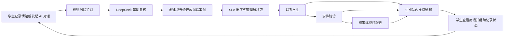
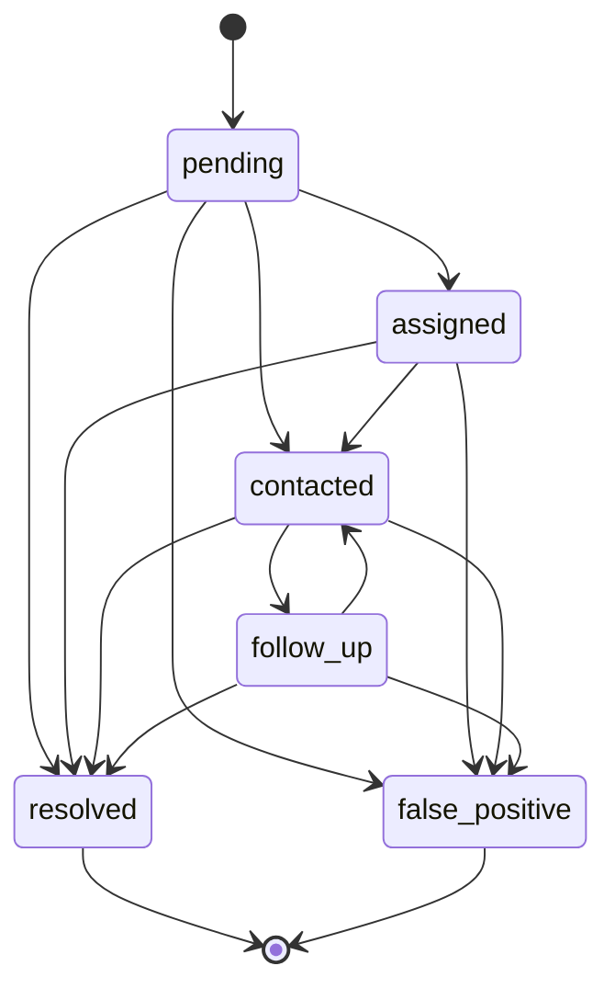
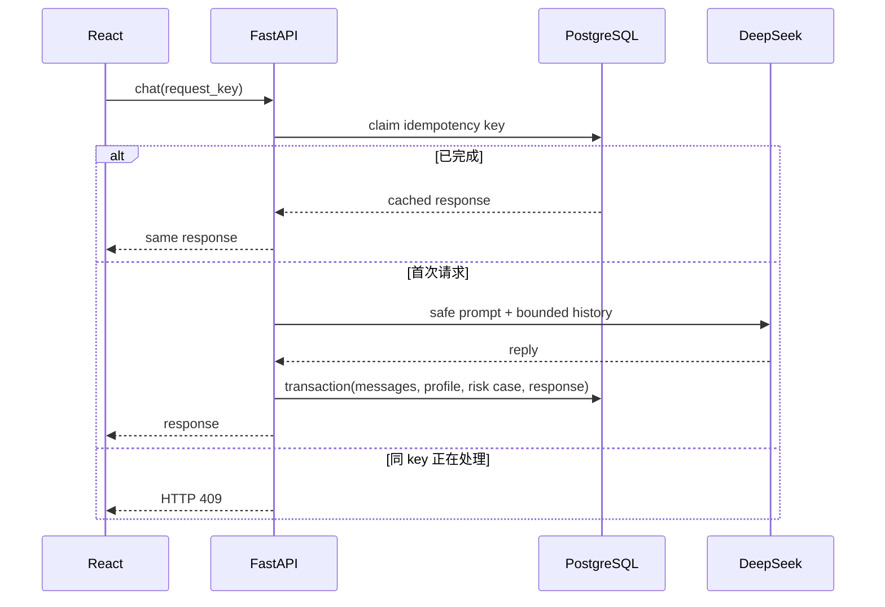

# 真实业务闭环与系统设计

## 设计目标

平台不是单次调用大模型的聊天页面，而是把“学生表达状态、系统识别风险、运营人员处置、学生收到反馈、后续继续观察”连接为可追踪业务流程。

核心约束：

- 安全优先：规则引擎是确定性底线，大模型只能补充或升级风险，不能降低规则结论。
- 隐私优先：会话默认私人，后台采用 RBAC，对外列表只返回公开且已审核内容。
- 一致性优先：对话写入支持请求幂等；风险案例使用状态机和乐观锁避免重复建单与并发覆盖。
- 可追溯：风险动作和管理员关键写操作分别进入业务时间线和审计日志。
- 可降级：DeepSeek、Redis 不可用时，核心记录、规则风险识别和安全回复仍可工作。

## 业务闭环

闭环中的每次状态变化会同时更新：

1. `risk_events` 当前案例快照。
2. `risk_actions` 不可覆盖的处置时间线。
3. `admin_audit_logs` 管理操作审计记录。
4. `user_notifications` 面向学生的支持进展。

## 风险案例状态机

- `critical` 案例默认 SLA 为 15 分钟，`high` 为 2 小时，其他需关注案例为 24 小时。
- 同一咨询下的开放风险信号会升级原案例，不重复创建待办。
- 客户端提交 `expected_version`；数据库使用 `WHERE id = ? AND version = ?` 原子更新。版本不一致返回 HTTP 409，避免两名管理员互相覆盖。
- 结案和误报必须填写说明；随访必须设置未来时间；非法状态跳转返回 HTTP 422。

## AI 请求一致性

`POST /api/consult/chat` 接受 `request_key`。客户端每次发送生成 UUID，服务端以 `(user_id, operation, idempotency_key)` 建立唯一约束。

- 模型调用前不写入半条聊天记录。
- 用户消息、AI 回复、画像、风险案例和幂等结果在一次收尾事务中提交。
- 处理中断的幂等键 5 分钟后可重新接管；已完成请求直接返回原响应。

## 数据与模块边界

| 模块 | 主要职责 | 核心数据 |
| --- | --- | --- |
| `risk_engine` | 确定性关键词、情绪趋势和解释信号 | 无状态 |
| `risk_cases` | 案例合并、SLA、状态机、乐观锁、通知 | `risk_events`、`risk_actions` |
| `idempotency` | 请求占位、并发冲突和结果复用 | `idempotency_records` |
| `audit` | 管理员关键操作留痕 | `admin_audit_logs` |
| `ai_client` | DeepSeek 调用、超时与安全降级 | 外部依赖 |
| `article_service` | 文章查询与缓存失效 | Redis + Article Repository |

## 扩展与故障处理

- FastAPI 服务保持无状态，可横向扩容；会话、案例、幂等和通知均落数据库。
- Redis 承担短期缓存、验证码和限流。Redis 不可用时降级为进程内缓存，适合本地开发；生产多实例必须使用 Redis。
- 风险队列按 `status`、`due_at`、`assigned_to` 建索引；审计与时间线按目标和时间建索引。
- DeepSeek 异常时返回本地安全回复，风险规则和案例创建不依赖模型可用性。
- 当前通知是站内通知。短信、企业微信或邮件可通过事务 Outbox + 异步 Worker 扩展，避免在 API 事务内调用第三方渠道。
- 当前分析查询适合实习项目和中小规模高校场景。达到万级 DAU 后，可把日指标异步聚合到统计表，并将审计日志归档到日志系统。

## 可观测性与 SLO

当前已具备 `X-Request-ID`、结构化访问日志、统一错误响应、健康检查、风险超时数量和基础压测报告。建议生产目标：

| 指标 | 建议目标 |
| --- | --- |
| 普通 API 可用性 | 99.9% |
| 非 AI API P95 | 小于 800 ms |
| 高风险案例超时数 | 0 |
| 重复 AI 请求产生重复消息 | 0 |
| 管理员关键写操作审计覆盖率 | 100% |

下一阶段可接入 Prometheus、Grafana 和 OpenTelemetry，按 `request_id` 串联 API、数据库、模型调用与异步通知。

## 关键取舍

- 风险判断采用“规则主判 + 模型辅助”，牺牲部分召回灵活性换取可解释与可控。
- 使用乐观锁而不是长事务悲观锁，适合读多写少的运营案例，冲突时让客户端刷新重试。
- 幂等结果保存于数据库而不是 Redis，保证重启后仍可复用；Redis 只承担可丢失的短期能力。
- 当前使用同步 DeepSeek 调用以保持交互简单；若并发继续增长，可升级为流式响应，并将摘要和画像更新移到异步任务。

